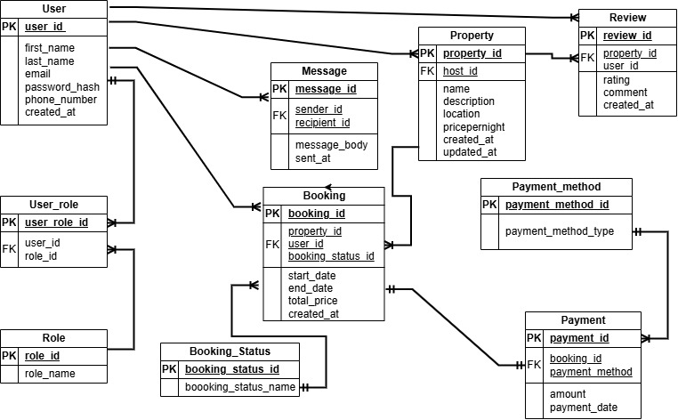

To achive the 3rd Normal Form for our database we have decided to make the following adjustments to achieve a robust, and scalable database.

- With initial database, user can only have one and only one role at a time. this forces host or admins to open a guest account if they wish to make a booking. also new roles will be difficult to add without making huge changes on our database.
- the adjustments takes care of these short comings

- likewise, new booking status and payment methods cannot be added without making huge chnages to our database, hence puting the roles, booking status and payment methods on a separate table makes for seamless scaling.

 - The Userroles table makes it possible for a user to take on more than one role at a time.